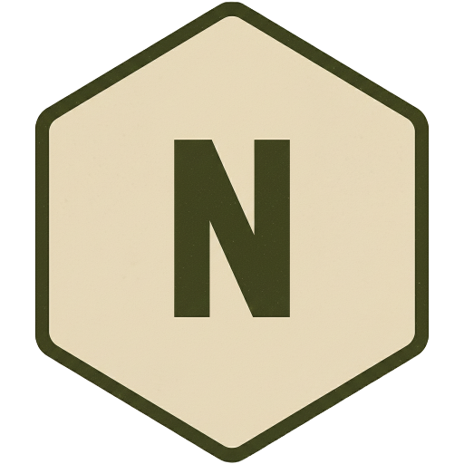

<p align="center"></p>

<h1 align="center">NOMAD for Unraid</h1>

<p align="center"><a href="https://www.projectnomad.us">Project NOMAD</a>, the offline knowledge and education server, as <b>one container</b>.</p>

NOMAD is built to run as five containers and to create one more for every app you install
(Kiwix, Kolibri, notes, ...). This image gives it a private Docker daemon, so all of that
happens inside a single container. Your server sees one app, one port and one update button,
and NOMAD itself runs completely unmodified.

- **One container.** NOMAD, its database, and every app it installs live inside it.
- **One address.** Apps open under paths of your NOMAD address instead of extra ports:
  `/wiki/`, `/learn/`, `/notes/`, `/cyberchef/`. Works behind any reverse proxy.
- **Normal updates.** Each image is pinned to a NOMAD release and tagged with its version.
  A new NOMAD release becomes a new image within about six hours, so Unraid shows
  *update available* and the release notes come along. The apps inside update themselves
  overnight in a window you choose.
- **Portable.** Everything is in three folders. Copy them to another machine, run the same
  image, and it comes up as it was.
- **Bring your own AI.** Point it at any OpenAI-compatible server (llama-swap, LM Studio,
  Ollama elsewhere) instead of running Ollama inside.

## Install

**Unraid:** Docker → Add Container → Template URL
`https://raw.githubusercontent.com/nphil/nomad-unraid/main/unraid/nomad.xml`, then fill in
the paths and your public URL.

**Anywhere else:**

```bash
docker run -d --name nomad --privileged --stop-timeout 120 -p 8085:80 \
  -v /fast/nomad:/config \
  -v /fast/nomad-docker:/var/lib/docker \
  -v /big/nomad:/data \
  -e PUBLIC_URL=https://knowledge.example.com \
  -e AI_URL=http://192.168.1.10:9292 \
  ghcr.io/nphil/nomad-unraid:latest
```

| Mount | Holds | Put it on |
| --- | --- | --- |
| `/config` | Database, settings, generated secrets | Fast disk; back it up |
| `/var/lib/docker` | The private daemon's images and containers | Fast disk; rebuildable, leave it out of snapshots and backups |
| `/data` | ZIM libraries, maps, courses, uploads | Big disk; tens to hundreds of GB |

| Variable | Default | What it does |
| --- | --- | --- |
| `PUBLIC_URL` | `http://localhost` | The address you open NOMAD at. App links are built from it. |
| `AI_URL` | *(empty)* | An OpenAI-compatible server, base URL without `/v1`. Empty means NOMAD's own AI setup. |
| `UPDATE_WINDOW` | `03:00-05:00` | When installed apps may update themselves, local time. |
| `TZ` | `UTC` | Time zone, which the update window uses. |

`--privileged` is required: the private Docker daemon needs it. For comparison, NOMAD's
normal install hands the admin container the host's Docker socket, which is the same
level of trust.

## Apps under a path

[`rootfs/etc/nomad/apps.json`](rootfs/etc/nomad/apps.json) lists which apps get a path and
how. Each app's own sub-path setting is applied to NOMAD's catalogue and re-applied every
ten minutes, because NOMAD resets its catalogue when it boots. An installed app found
without its setting is reinstalled; its data lives in `/data` and is kept.

| App | Path | Notes |
| --- | --- | --- |
| Kiwix (Information Library) | `/wiki/` | |
| Kolibri (Education Platform) | `/learn/` | Lesson files are served from `/learn-content/`, see below |
| FlatNotes (Notes) | `/notes/` | |
| CyberChef (Data Tools) | `/cyberchef/` | |

Not supported, because they cannot run under a sub-path: **IT Tools**, **Excalidraw** and
**Homebox** (hard-coded root paths). Any other catalogue app still installs and works on
its own port, but that port is only reachable inside the container.

**Kolibri's lesson files.** Kolibri sandboxes lesson content by loading it from a second
web origin, which by default is the same host on port 8311. Behind one address that port is
unreachable, so here the content is served from `/learn-content/` on the main address
instead. That keeps everything on one hostname, at the cost of the extra isolation a
separate origin gives. The official Kolibri channels are the intended content.

## AI and knowledge-base search

With `AI_URL` set, NOMAD uses that server for chat, and it never installs Ollama. NOMAD's
knowledge-base search needs the embedding model **`nomic-embed-text:v1.5`** by that name
(its index is built for that model's 768 dimensions), so the server has to provide it. For
llama-swap:

```yaml
  nomic-embed-text-v1.5:
    cmd: |
      llama-server --host 127.0.0.1 --port ${PORT}
      -m /models/nomic-embed-text-v1.5.Q8_0.gguf
      --embedding --pooling mean -ngl 999 -c 2048 -b 2048 -ub 2048
    aliases: ["nomic-embed-text:v1.5"]
```

On a GPU it takes about 400 MB of VRAM. With `-ngl 0` it runs on the CPU instead, which is
fine for searching (about 45 ms a query) but about 20 times slower to index a library;
it does not save host RAM either way.

Qdrant, NOMAD's vector database, is normally installed only together with its own
Ollama, so with `AI_URL` set this image installs it and runs one indexing pass. NOMAD's
ingest policy (*Always*, or *Manual* in the knowledge-base panel) then decides whether new
ZIM libraries are indexed automatically. A full Wikipedia is hours of work even on a GPU,
so *Manual* is worth considering before downloading one.

**Known limitation with llama.cpp-based servers.** NOMAD cuts text into chunks by
JavaScript string length, which can split an emoji in half. The half is invalid JSON, and
llama.cpp's strict parser rejects that batch (Ollama tolerates it). The affected file shows
as failed in the knowledge-base panel; everything else indexes normally. On beastnas this
hit 1 of NOMAD's 13 help docs (its release notes, which are full of emoji). It is a NOMAD
bug and belongs upstream.

## Updates

| What | How |
| --- | --- |
| NOMAD itself | A new image per NOMAD release (tag `1.34.1`, plus `latest`). Update the container as usual. NOMAD's own self-updater is switched off, so the two never compete. |
| Packaging changes | Rebuild of the same NOMAD version, tagged as a revision (`1.34.1-r2`). |
| Apps inside NOMAD | NOMAD's app auto-update, inside `UPDATE_WINDOW`. |

Every build publishes a [GitHub Release](../../releases) with NOMAD's release notes.

## How it works

On start, [`nomad-entrypoint`](rootfs/usr/local/bin/nomad-entrypoint) starts the private
daemon, renders upstream's compose file pinned to this image's NOMAD version, brings the
stack up, and starts a Caddy proxy on port 80 that sends each app path to its app and
everything else to NOMAD. On stop, it lets the daemon stop every container itself, so they
all come back on the next start.

## Credits

[Project NOMAD](https://github.com/Crosstalk-Solutions/project-nomad) is by Crosstalk
Solutions under the Apache 2.0 license, and the icon is NOMAD's own. This repository only
packages it and is not affiliated with Crosstalk Solutions.
